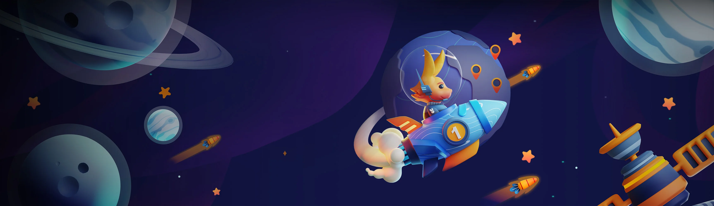

# @8ctopotamus/bunnycdn

A NodeJS SDK for [Bunny.Net CDN](https://bunny.net/).

<a href="https://bunny.net/" target="_blank" title="Bunny.net website"></a>

The properties and methods mirror the endpoints described in the **[BunnyCDN API Docs](https://docs.bunny.net/docs)**.

> ⚠ IMPORTANT: This is not anywhere near ready for use in actual projects. 

## Usage

```js
import BunnyCDN from '@8ctopotamus/bunnycdn'

// configure the SDK
const bunny = new BunnyCDN({
  pullzone: process.env.BUNNY_NET_PULLZONE,
  accessKey: process.env.BUNNY_NET_ACCESS_KEY,
  storageZoneName: process.env.BUNNY_NET_STORAGEZONE_NAME,
  storageZonePassword: process.env.BUNNY_NET_STORAGEZONE_PASSWORD,
  storageZoneRegion: process.env.BUNNY_NET_STORAGEZONE_REGION, // may be excluded if not applicable
})

// Example: GET all pullzones
console.log( await bunny.pullzone.list() )

// more examples/documentation to come...
```

## Develop

Create and fill out a `.env` file in the root of the project:

```env
BUNNY_NET_PULLZONE=your_pullzone_name
BUNNY_NET_ACCESS_KEY=your_access_key
BUNNY_NET_STORAGEZONE_NAME=your_storagezone_name
BUNNY_NET_STORAGEZONE_PASSWORD=your_storagezone_password
BUNNY_NET_STORAGEZONE_REGION=your_storagezone_region_if_exists
```

Run `npm run test`

## TODO

### Edge Storage API

NOTE: I need to use storage in an upcoming project, so starting here...

* [...] Manage Files
  * [...] Download File
  * [...] Upload a File
  * [...] Delete a File

* [...] Browse Files
  * [...] List Files

### Bunny.Net API

* [] Abuse Case
* [] Countries
* [] Billing
* [] Compute
* [] Support
* [] DRM Certificate
* [] Region
* [] Stream Video Library
* [] DNS Zone
* [...] Pull Zone
* [] Purge
* [] Statistics
* [] Storage Zone
* [] User

### Stream API

* [] Manage Collections
  * [] Get Collection
  * [] Update Collection
  * [] Delete Collection
  * [] Get Collection List
  * [] Create Collection

* [] Manage Videos
  * [ ] Get Videoget
  * [ ] Update Videopost
  * [ ] Delete Videodelete
  * [ ] Upload Videoput
  * [ ] Get Video Heatmapget
  * [ ] Get Video Statisticsget
  * [ ] Reencode Videopost
  * [ ] List Videosget
  * [ ] Create Videopost
  * [ ] Set Thumbnailpost
  * [ ] Fetch Videopost
  * [ ] Add Captionpost
  * [ ] Delete Caption

## Inspirations

* [Code with Mark BunnyCDN](https://github.com/codewithmark/bunnycdn)
* [BunnyCDN.PHP.Storage](https://github.com/BunnyWay/BunnyCDN.PHP.Storage#downloading-objects)

## Helpful links for me

* [How to allow ES6 Import/Exports AND CommonJS](https://www.sensedeep.com/blog/posts/2021/how-to-create-single-source-npm-module.html)
* [Create NPM package with Typescript](https://spfx-app.dev/create-your-npm-package-with-typescript-in-a-few-minutes)
* [SO: how to make jest run tests in a specific order](https://stackoverflow.com/questions/49247539/how-to-make-jest-run-tests-in-a-specific-order)

